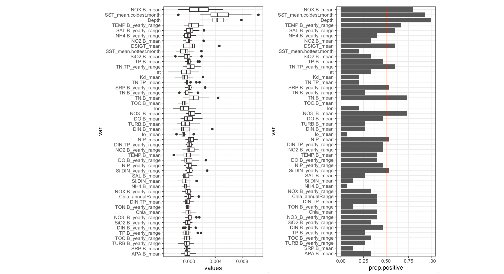
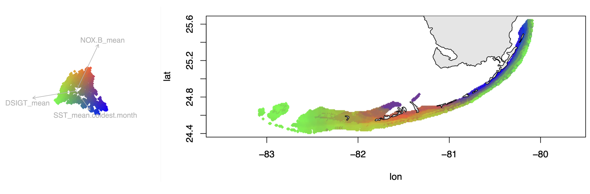

# RDA-forest
## Using random forest to analyze shapes of multivariate datasets

> Citation: Kristina Black, J. P. Rippe, and Mikhail Matz. 2024 "RDA-forest: identifying envrironmental factors driving polygenic adaptation", in submission.

RDA forest is a way to detect associations between principal components of a response matrx *Y* and a matrix of potential explanatory variables *X*. Essentially, the method looks for clusters, extensions, and bumps in the multivariate cloud of data points that can be explained by any combination of variables in *X* (including all sorts of non-linear dependencies and multi-way interactions). We call this approach RDAforest, to reflect the fact that it has the same purpose as redundancy analysis (RDA) - to find associations between highly dimensional data and multiple predictor variables - except RDA-forest relies on more versatile RF instead of linear regressions. 

### Application to Genotype-Environment Association (GEA) analysis

In the example here *Y* is the matrix of genetic distances between individuals and *X* is a matrix of environmental variables measured for all individuals in *Y*. Unlike most other GEA methods, we are not trying to find specific loci associated with environment, but want to identify the environmental variables that drive polygenic local adaptation. Polygenic adaptation [alters the genome-wide covariance structure](https://doi.org/10.1111/2041-210X.13722), which means that similarly adapted organisms become slighly more similar to each other genetically than to their peers adapting to a different environment. Our method aims to identify environmental parameters driving this subtle pattern of genetic similarity, captured by the leading principal components (PCs) of the genetic distance matrix. 

### Overview

The method relies on `gradientForest` package in R, which is extension of the random forest approach to multiple response variables. Its main advantags over regression- and model-based methods are:
- it identifies all sorts of non-linear and non-monotonous relationships as well as linear ones;
- it automatically accounts for all possible interactions between predictors;
- it easily corrects for spatial autocorrelation between samples by including their geographic coordinates into the model, since gradient forest regression can capture any spatial configuration of samples based on just the two coordinates;
- it handles correlated predistors properly, using  to determine their importance;
- it uses cross-validation to compute importance of predictors, so what it reports is the actual predictive power of the model for a completely new set of data.

In addition, there are two novel ideas in our RDA-forest method:
- **Jackknifing**: We use "ordination jackknife" procedure, which rebuilds the ordination multiple times based on a subset (default 0.8 of total) of all samples and reruns the analysis. This models the uncertainty of PCs determination.
- **Mtry-based variable selection**: To detect and discard predictors that are not by themselves important but are correlated with an important one, we use the `mtry`criterion. `mtry` is the number of randomly chosen predictors to find the next split in the tree. With higher `mtry` there is a higher chance that the actual driver is chosen together with the non-influential correlated variable and is then used for the split. As a result, the correlated variable is used less often, which drives its importance down (Strobl et al 2008). So, we fit two models with different `mtry` settings to each ordination jackknife replicate. Predictors consistently showing diminished raw importance at the higher `mtry` setting are then discarded.

### Installation 

The RDA-forest functions come in the form of an R package, `RDAforest_2.1.5.tar.gz`. To install it, run this in Rstudio
```R
install.packages("/path/to/downloaded/file/RDAforest_2.1.5.tar.gz")
library(RDAforest)
```

The package depends on `vegan`, `dplyr`, and `gradientForest`. Installing `gradientForest` is more involved than a typical R package since it must be compiled from source. 

First, install `devtools`. 
```R
install.packages("devtools")
```
This may require additional installations outside R. Hopefully they will happen automatically, if not, see [here](https://www.r-project.org/nosvn/pandoc/devtools.html).
Then:
```R
install.packages("gradientForest", repos="http://R-Forge.R-project.org")
```
If this one fails, chances are, you need to install `gfortran` first, FOR YOUR SYSTEM from here:
https://gcc.gnu.org/wiki/GFortranBinaries or, for Mac, https://github.com/fxcoudert/gfortran-for-macOS/releases. If there is no precompiled `gfortran` for your combination of processor and OS, choose the one for the closest OS for your processor.
On a Mac you might also need to point your Rstudio compiler to the location `gfortran` is installed at, by creating/modifying the file *~/.R/Makevars*. The following spell in `Terminal` should work:
```sh
cd
mkdir .R
echo "FC = /usr/local/bin/gfortran
F77 = /usr/local/gfortran
FLIBS = -L/usr/local/gfortran/lib" >> ~/.R/Makevars
```
To check if everything was intalled correctly, do this in Rstudio and see if the package is loaded without errors.
```R
library(gradientForest)
```
### RDAforest functions
All functions have documentation accessible as usual by asking `?functionName` in R, for example to see what are the necessary arguments and what does the function return. There are four functions:

- `makeGF_simple` : A simple wrapper for the *gradientForest()* function, uses straight-up response matrix *Y*.
- `makeGF` : Runs gradient forest analysis on an ordination object made by *vegan::capscale()* or *vegan::rda()*.
- `ordinationJackknife` : Runs *gradientForest* on *nreps* jackknife replicates, each time rebuilding the ordination withholding a fraction of datapoints (default 0.25).
- `mtrySelJack` : Performs variable selection based on *mtry* criterion: variables that are not important by themselves, only correlated with the actually important ones, begin to lose importance at higher *mtry* setting (Strobl et al 2018). The function runs *nreps* jackknife replicates on an ordination, fitting two *gradientForest* models with different *mtry* settings. It then selects variables that do not decrease in importance at higher *mtry*. Can be made more allowing (i.e. retain more predictors) by using lower *mtry* values (add options `mintry=3, maxtry=6`). The default setting (`mintry`= *N*/5, `maxtry`=2*N*/5 where *N* is the number of predictors) is fairly conservative, i.e. tends to leave only a handful of the most influential predictors.
- `predict_rf` : Predicts *Y* values based on *extendedForest::randomForest*. These values are used for plotting adaptation (see `plot_adaptation`). Makes sure no predictions are made beyond the range of predictors used to fit the model.
- `predict_gf` : Generates turnover curves with *gradientForest*. These should **not** be used directly for plotting adaptation but are very good for clustering points into adaptive neighborhoods (see `plot_adaptation`). Just like `predict_rf`, makes sure no predictions are made beyond the range of predictors used to fit the model.
- `plot_adaptation` : Plots first two PCs of the supplied matrix ( *[ result of predict_rf ]$preds* ), then plots geographical map of adaptation colored according to the first two PCs. Can color points by their continuous values along PCs, or by cluster they fall into (with `nclust` argument). Clustering is done using function *cluster::clara*. Starting with version 2.1.1 can use turnover curves (result of *predict_gf*) for clustering (option *clustering.guide=[ result of predict_gf ]$preds* ) and merge clusters if they are too similar accoring to *predict_rf* predictions. That can generate more robust clustering than clustering *predict_rf* predictions straight up. Cluster merging is controlled by *cluster.merge.threshold* parameter, which can be chosen using the third plot of hierarchical tree of clusters.
- `plot_turnover` : Plots turnover curve for the specific *X* preedictor, based on object returned by *ordinationJackknife* with option *predict.mode="turnover"*. 
- `dummify` : Turns a dataframe containing numerical and categorical predictors into fully numerical.
- `sum_up_importances` : Sums up importances of original factors that were dummified using 'dummify()'

### Example analyses

#### Simple:

Assuming we have a square matrix of genetic distances `Y` and a dataframe of possible predictor variables `X` (samples are rows, predictors are columns), the first thing we would want to run is variable selection procedure based on *mtry* criterion:

```R
mm = mtrySelJack(Y,X)
```

There are a few ways to visualize the results. The first one is boxplot of importance differences at different *mtry*. Variables that do NOT decline in importance at higher *mtry* (boxplots above red line) are likely truly influential ones; others may be simply correlated with them but not influential by themselves.
```R 
ggplot(mm$delta,aes(var,values))+
  geom_boxplot()+
  coord_flip()+
  geom_hline(yintercept=0,col="red")
```
And the second one is a bar chart of proportion of positive change in response to higher *mtry*. Good predictors would be the ones above the red line (do not decline in importance in more than half of replicates).
```R
ggplot(mm$prop.positive,aes(var,prop.positive))+
  geom_bar(stat="identity")+
  coord_flip()+
  geom_hline(yintercept=0.5,col="red")
```


Then, we run the RDA-forest analysis using just the variables that passed the *mtry* criterion, which are listed in `mm$goodvars` at this point:
```R
rf=ordinationJackknife(Y,X[,mm$goodvars])
```
and plot the inferred variable importances (cross-validation R2):

```R
ggplot(rf$all.importances,aes(variable,importance))+geom_boxplot()+coord_flip()+theme_bw()
```


### Example of full-on analysis of seascape genomics data

There many additional arguments that may be important in actual analysis, such as nuisance covariates to remove, number of jaccknife replicates to run, or number of leading PCs to consider. We also typically need to account for spatial covariance of the data. Moreover, there is a way to use the RDA-forest model to predict adaptation in locations that were not sampled for genetics. The script `RDA-forest_0221.R` illustrates all these additions, analyzing genetic distances of the coral *Agaricia agaricites*. It is well-commented so hopefully it is clear what is going on. 

There are some preparatory stages, including examination of clonality/relatedness structure and visualization of the PCA of the data. Then we select influential variables using `mtrySelJack` (including spatial variables, latitude and longitude, in the selection process) and measure their importance with `ordinationJackknife`, as above. While running `ordinationJackknife`, we also supply the argument `newX` that contains predictor values for a bunch of unsampled locations covering the whole Florida Keys. This will let us generate a map of the coral's differential adaptation across the whole Florida Keys seascape. Contrasting colors in the map signify differential adaptation.  

 

It is also possible to plot the same map after clustering the points by similarity of predicted adaptation, resulting in a map of "adaptive neighborhoods":
 

> NOTE on terminology: For purely historical reasons, Principal Component Analysis of a distance matrix is called a Principal Coordinates Analysis, and its principal components are called, correspondingly, "principal coordinates". Their mathematical meaning is essentially the same as principal components so we were calling them thus throughout this vignette, to keep it simple. 

### Suggested readings
- [short and sweet intro into decision trees and random forest](https://towardsdatascience.com/understanding-random-forest-58381e0602d2)
- `death00_classification_regression_trees.pdf` : great intro into regression trees, for ecological data
- `ellis_gradient_forest.pdf` : dense but very comprehensive outline of the gradient forest approach
-  [vignette for the `gradientForest` package](https://gradientforest.r-forge.r-project.org/biodiversity-survey.pdf)
- `strobl_conditional_permutation_mtry.pdf` : deals with the problem of correlated predictors, contains simulations which are the basis for predictor selection method used here.
- `bay18_songbird_science.pdf` : example application of gradient forest to predict bird adaptation and vulnerability to climate change

