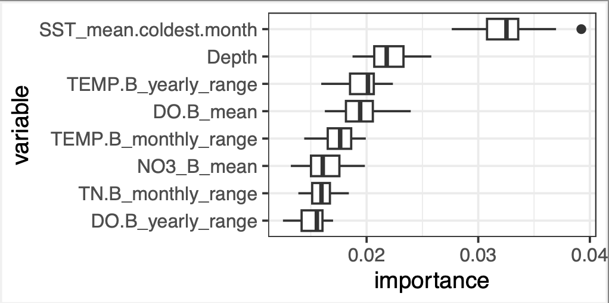
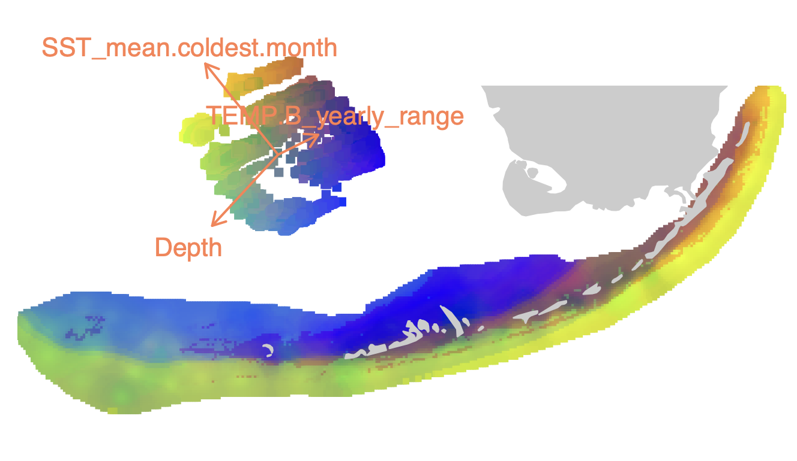

# RDA-forest
## Using random forest to analyze shapes of multivariate datasets

> Citation: K. Black, J. P. Rippe, and M. Matz 2022. “Environmental Drivers of Genetic Adaptation in Florida Corals.” europepmc.org/article/ppr/ppr579436. (preprint; in revision for Molecular Ecology)

RDA forest is a way to detect associations between principal components of a response matrx *Y* and a matrix of potential explanatory variables *X*. Essentially, the method looks for clusters, extensions, and bumps in the multivariate cloud of data points that can be explained by any combination of variables in *X* (including all sorts of non-linear dependencies and multi-way interactions). The name "RDA forest" reflects the fact that we are trying to solve broadly the same problem as redundancy analysis (RDA), only using the more versatile random forest approach instead of linear regressions. 

### Application to Genotype-Environment Association (GEA) analysis

In the example here *Y* is the matrix of genetic distances between individuals and *X* is a matrix of environmental variables measured for all individuals in *Y*. Unlike most other GEA methods, we are not trying to find specific loci associated with environment, but want to leverage the polygenic nature of adaptation to identify the variables that truly matter for our creatures. The fundamental assumption is that adaptation to the same conditions make organisms slightly more similar to each other, genome-wide, than to their peers living in a different environment. We aim to identify environmental gradients driving this subtle genetic structure. 

### Overview

The method relies on `gradientForest` package in R, which is extension of the random forest approach to multiple response variables. Its main advantags over regression- and model-based methods are:
- it identifies all sorts of non-linear relationships as well as linear ones
- it automatically accounts for all possible interactions between predictors
- it uses cross-validation to compute importance of predictors, so what it reports is the actual predictive power of the model for a completely new set of data.

In addition, there are two non-trivial ideas in our RDA-forest method:
- It uses "spatial bootstrap" to ensure that detected associations are not due to the chance configuration of principal components. The analysis is repeated multiple times, each time rotating the cloud of data points in a random direction and re-forming the principal components to be orthogonal to that direction.
- To detect and discard predictors that are not by themselves important but are correlated with an important one, we use the `mtry`criterion. `mtry` is the number of randomly chosen predictors to find the next split in the tree. With higher `mtry` there is a higher chance that the actual driver is chosen together with the non-influential correlated variablea and is then used for the split. As a result, the correlated variable is used less often, which drives its importance down (Strobl et al 2008). So, we fit two models with different `mtry` settings to each spatial bootstrap replicate. Predictors showing diminished raw importance at the higher `mtry` setting in more than half of all replicates are discarded.

A histogram of how frequently raw importance increases at higher *mtry* across variables can help decide whether the data are strong enough to generate reliable result:

 

### Installation 

The RDA-forest functions come in the form of an R package, `RDAforest_[version number].tar.gz`. To install it, run this in Rstudio
```R
install.packages("/path/to/downloaded/file/RDAforest_0.0.0.9000.tar.gz")
library(RDAforest)
```
The package depends on `vegan`, `dplyr`, `ggplot2`, and `gradientForest`. Installing `gradientForest` is more involved than a typical R package since it must be compiled from source. 

First, install `devtools`. 
```R
install.packages("devtools")
```
This may require additional installations outside R. Hopefully they will happen automatically, if not, see [here](https://www.r-project.org/nosvn/pandoc/devtools.html).
Then:
```R
install.packages("gradientForest", repos="http://R-Forge.R-project.org")
```
If this one fails, chances are, you need to install `gfortran` first, FOR YOUR SYSTEM from here:
https://gcc.gnu.org/wiki/GFortranBinaries or, for Mac, https://github.com/fxcoudert/gfortran-for-macOS/releases. If there is no precompiled `gfortran` for your combination of processor and OS, choose the one for the closest OS for your processor.
On a Mac you might also need to point your Rstudio compiler to the location `gfortran` is installed at, by creating/modifying the file *~/.R/Makevars*. The following spell in `Terminal` should work:
```sh
cd
mkdir .R
echo "FC = /usr/local/bin/gfortran
F77 = /usr/local/gfortran
FLIBS = -L/usr/local/gfortran/lib" >> ~/.R/Makevars
```
To check if everything was intalled correctly, do this in Rstudio and see if the package is loaded without errors.
```R
library(gradientForest)
```
### RDAforest functions
All functions have documentation accessible as usual by asking `?functionName` in R, for example to see what are the necessary arguments and what does the function return. There are four functions:
- `makeGF.simple` : A simple wrapper for the *gradientForest()* function, uses straight-up response matrix *Y*.
- `makeGF` : Runs gradient forest analysis on an ordination object made by *vegan::capscale()* or *vegan::rda()*.
- `mtrySelection` : Performs variable selection based on *mtry* criterion: variables that are not important by themselves, only correlated with the actually important ones, begin to lose importance at higher *mtry* setting (Strobl et al 2018). The function runs *nreps* spatial bootstrap replicates on an ordination, fitting two *gradientForest* models with different *mtry* settings. It then selects variables that do not decrease in importance at higher *mtry*.
- `spatialBootstrap` : Runs *gradientForest* on *nreps* ordination replicates, each time rotating the cloud of datapoints in a random direction and reforming principal axes to be orthogonal to that direction.

### Example analysis

The script `RDA-forest.R` analyzes genetic distances of `Agaricia agaricites` coral. It is well-commented so hopefully it is clear what is going on. There are some preparatory stages, including examination of clonality/relatedness structure and forming of spatial variables to account for genetic correlation due to spatial proximity. Then we select influential variables using `mtrySelection` and measure their importance with `spatialBootstrap`. 



Finally, use our new knowledge of how environment affects coral genetics to create a map of the coral's differential adaptation across the whole Florida Keys seascape. Contrasting colors in the map signify differential adaptation, likely driven by factors highlighted in the legend.

 

> NOTE on terminology: For purely historical reasons, Principal Component Analysis of a distance matrix is called a Principal Coordinates Analysis, and its principal components are called, correspondingly, "principal coordinates". Their mathematical meaning is essentially the same as principal components so we were calling them thus throughout this vignette, to keep it simple. 

### Suggested readings
- [short and sweet intro into decision trees and random forest](https://towardsdatascience.com/understanding-random-forest-58381e0602d2)
- `death00_classification_regression_trees.pdf` : great intro into regression trees, for ecological data
- `ellis_gradient_forest.pdf` : dense but very comprehensive outline of the gradient forest approach
-  [vignette for the `gradientForest` package](https://gradientforest.r-forge.r-project.org/biodiversity-survey.pdf)
- `strobl_conditional_permutation_mtry.pdf` : deals with the problem of correlated predictors, contains simulations which are the basis for predictor selection method used here.
- `bay18_songbird_science.pdf` : example application of gradient forest to predict bird adaptation and vulnerability to climate change

